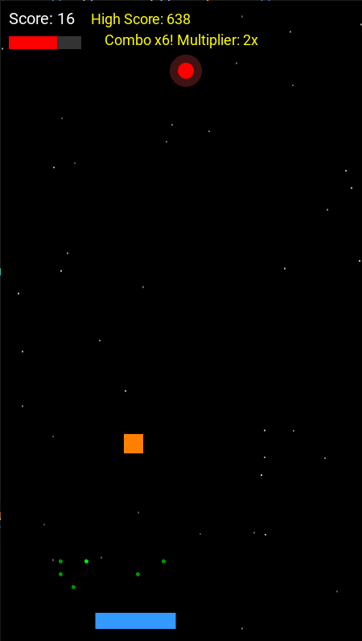
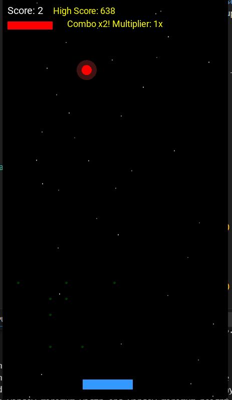

# Kivy Catch Game

A simple, addictive catch game built with Python and Kivy. Move your paddle to catch falling balls, earn combos, collect power-ups, and try to beat your high score!

---

## Features

- **Smooth Controls:** Drag to move the paddle.
- **Combo System:** Consecutive catches increase your score multiplier.
- **Power-Ups:** Collect falling items for slow motion, double points, extra life, and paddle size changes.
- **Health Bar:** Misses are shown as a health bar.
- **Persistent High Score:** Your best score is saved between sessions.
- **Visual Effects:** Particle trails, glowing ball, and animated starfield background.
- **Pause/Resume:** Pause the game at any time.
- **Mobile-Friendly:** Fixed portrait window for easy play on touch devices.

---

## Screenshots




---

## How to Run

1. **Install dependencies:**
    ```sh
    pip install kivy
    ```

2. **Run the game:**
    ```sh
    python main.py
    ```

---

## How to Build as Windows EXE

1. **Install PyInstaller:**
    ```sh
    pip install pyinstaller
    ```
2. **Build:**
    ```sh
    pyinstaller --onefile --noconsole main.py
    ```
3. **Copy assets** (`*.wav`, `highscore.txt`) to the `dist` folder if needed.

---

## Repository Structure
